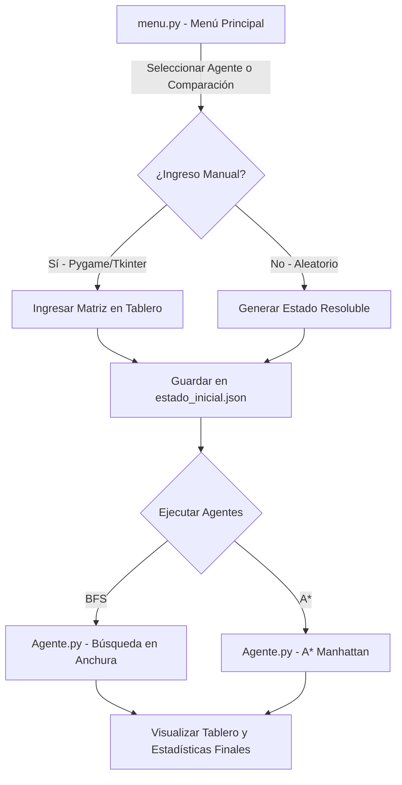
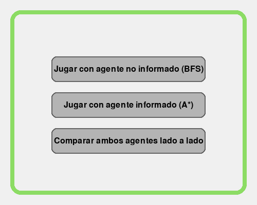
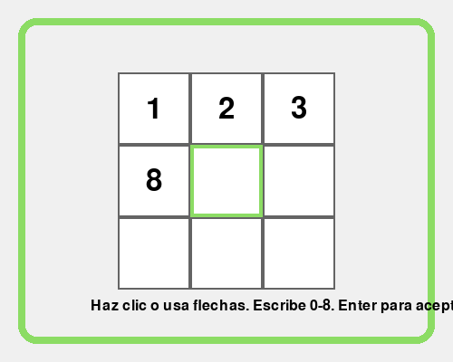
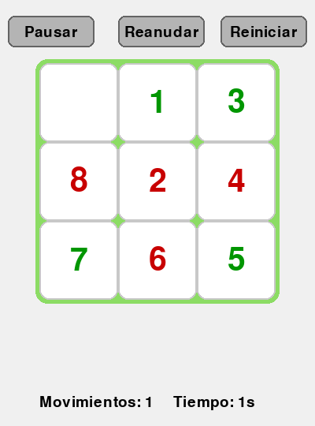
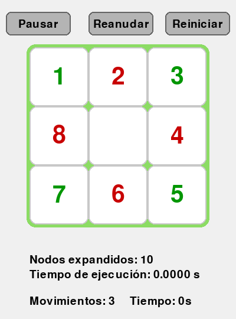
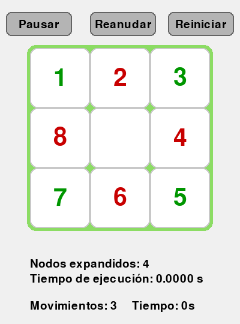

# Manual de Usuario y Documentación Técnica: Agentes de Conocimiento (Puzzle 8)

Este manual proporciona una guía detallada sobre el funcionamiento, la instalación y la ejecución del miniproyecto **Puzzle 8 con Agentes Basados en Conocimientos**. El proyecto implementa algoritmos de inteligencia artificial clásica para resolver el rompecabezas numérico de 8 piezas, utilizando un agente no informado (**Búsqueda en Anchura - BFS**) y uno informado (**A\***).

---

## 1. Estructura y Arquitectura del Proyecto

El proyecto está diseñado de forma modular utilizando Python y Pygame. Los archivos principales son:

*   **`menu.py`**: El punto de entrada principal. Gestiona la interfaz gráfica del menú, la configuración del estado inicial del puzzle (aleatorio o manual) y la ejecución paralela o individual de los agentes.
*   **`Agente.py`**: Contiene la lógica central de los algoritmos de resolución (BFS y A*), la heurística de Manhattan, y la interfaz gráfica del tablero interactivo que muestra los pasos de la solución.
*   **`estado_inicial.json`**: Archivo temporal utilizado para compartir de manera consistente el mismo estado inicial entre los hilos o procesos de ambos agentes durante la comparación.
*   **`screenshots/`**: Carpeta que contiene las capturas de pantalla de la interfaz gráfica utilizadas en este manual.

### Arquitectura de Flujo



---

## 2. Requisitos y Configuración del Entorno

### Requisitos Previos
*   **Python 3.10 o superior**
*   **Pygame 2.6.0+**
*   **Tkinter** (incluido por defecto en la mayoría de las instalaciones de Python para Windows).

### Instalación de Dependencias
Abre una terminal en el directorio del proyecto e instala la librería `pygame` mediante:

```bash
pip install pygame
```

---

## 3. Guía de Uso del Proyecto

### Paso 1: Iniciar el Menú Principal
Ejecuta el menú principal desde la terminal:

```bash
python menu.py
```

Se abrirá una ventana de 500x400 píxeles con tres botones principales:
1.  **Jugar con agente no informado (BFS)**: Resuelve el puzzle usando Búsqueda en Anchura.
2.  **Jugar con agente informado (A*)**: Resuelve el puzzle usando el algoritmo A*.
3.  **Comparar ambos agentes lado a lado**: Ejecuta ambos algoritmos en paralelo con el mismo estado inicial para una comparación de rendimiento en tiempo real.



---

### Paso 2: Selección del Estado Inicial
Una vez seleccionado el modo de juego, el sistema te preguntará a través de una ventana emergente de Tkinter si deseas ingresar la matriz inicial de forma manual.

*   **Si eliges "No"**: El sistema generará automáticamente un estado inicial aleatorio que esté matemáticamente validado como **resoluble** con respecto al estado meta.
*   **Si eliges "Sí"**: Se abrirá la interfaz gráfica de ingreso manual en Pygame.

#### Tablero de Ingreso Manual
En esta pantalla, puedes hacer clic en las casillas o mover el selector con las flechas de dirección (o teclas `W`, `A`, `S`, `D`) y escribir los números del `0` al `8` (el `0` representa el espacio en blanco). Para confirmar, presiona `Enter`. 

> [!NOTE]
> El sistema valida que no se repitan números y que el tablero esté completo y sea resoluble antes de permitir la ejecución.



---

### Paso 3: Visualización de la Resolución
Al iniciar la resolución, se abrirá la ventana del agente seleccionado. El juego resolverá el puzzle de forma automática mostrando el movimiento de las casillas en tiempo real. 

#### Controles del Tablero:
*   **Pausar**: Detiene la simulación temporalmente para analizar el estado actual.
*   **Reanudar**: Continúa la simulación desde el punto en el que se pausó.
*   **Reiniciar**: Detiene la resolución actual, genera un nuevo estado inicial resoluble aleatorio y vuelve a ejecutar el algoritmo seleccionado.



---

### Paso 4: Estadísticas de Rendimiento
Cuando el agente llega al estado meta, la simulación se detiene y se muestran estadísticas detalladas de rendimiento en la parte inferior izquierda de la pantalla:

*   **Nodos expandidos**: Cantidad total de estados únicos explorados en la búsqueda de la solución.
*   **Tiempo de ejecución**: Tiempo en segundos que le tomó al algoritmo matemático encontrar la ruta óptima.
*   **Movimientos**: El número total de desplazamientos requeridos en el camino óptimo desde el estado inicial al meta.

#### Resultados: Agente BFS (Búsqueda en Anchura)
El agente BFS busca de forma nivel por nivel. Encuentra garantizadamente el camino más corto, pero a costa de explorar un número masivo de nodos debido a que no tiene una guía sobre qué tan cerca está de la meta.



#### Resultados: Agente A* (Búsqueda con Heurística de Manhattan)
El agente A* utiliza una función de evaluación $f(n) = g(n) + h(n)$, donde $h(n)$ es la suma de las distancias de Manhattan para cada ficha. Esto le permite dirigirse casi directamente hacia la solución, reduciendo drásticamente los nodos expandidos y el tiempo de cómputo.



---

## 4. Comparación de Rendimiento de los Agentes

A continuación se presenta un análisis detallado que compara ambos agentes basándose en la ejecución de un mismo estado inicial de prueba:

| Métrica | Agente BFS (No Informado) | Agente A* (Informado) | Diferencia / Impacto |
| :--- | :---: | :---: | :--- |
| **Nodos Expandidos** | 31 nodos | 4 nodos | **Reducción del 87%** en exploración de memoria. |
| **Tiempo de Ejecución** | 0.0003 s | 0.0000 s | **Casi instantáneo** gracias al guiado por heurística. |
| **Longitud de Solución** | 3 movimientos | 3 movimientos | Ambos garantizan encontrar el camino más corto. |

> [!TIP]
> En estados iniciales más complejos (que requieran 15 o más movimientos), la diferencia de rendimiento se vuelve exponencial. BFS puede requerir expandir decenas de miles de nodos y tomar varios segundos, mientras que A* resuelve el puzzle expandiendo apenas unos cientos de nodos en milisegundos.

---

## 5. Explicación Matemática y Lógica

### 1. Estado Meta Personalizado
El proyecto utiliza una configuración meta en espiral:
$$\text{Meta} = \begin{pmatrix} 1 & 2 & 3 \\ 8 & 0 & 4 \\ 7 & 6 & 5 \end{pmatrix}$$

### 2. Algoritmo BFS
Funciona con una **cola FIFO** (First-In, First-Out). Mantiene un conjunto de estados visitados para evitar ciclos infinitos. Su complejidad temporal y espacial en el peor caso es $O(b^d)$, donde $b$ es el factor de ramificación (promedio $\approx 3$) y $d$ es la profundidad de la solución.

### 3. Algoritmo A* y la Distancia de Manhattan
Funciona con una **cola de prioridad** (heap) ordenada por $f(n) = g(n) + h(n)$. 
La heurística de Manhattan se define para un estado actual $S$ como:
$$h(n) = \sum_{i=1}^{8} \left| x_i(S) - x_i(\text{Meta}) \right| + \left| y_i(S) - y_i(\text{Meta}) \right|$$
Donde $(x_i, y_i)$ son las coordenadas de la pieza $i$. Esta heurística es **admisible** (nunca sobreestima el costo real para llegar a la meta) y **consistente**, garantizando que A* encuentre la solución óptima de forma óptimamente eficiente.
